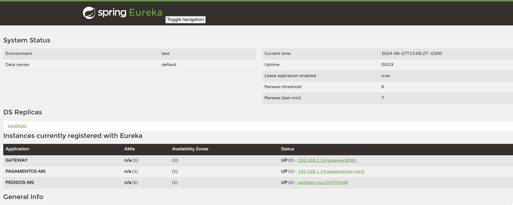

# Alura Food

## Descrição
Este é um repositório do projeto Alura Food, que foi desenvolvido no curso 'Microsserviços na prática: implementando com Java e Spring' da Alura. 
Este projeto tem como objetivo entender as desvantagens de utilizar comunicação síncrona e implementar a comunicação assíncrona através do RabbitMQ. 
Durante o curso, exploramos os principais conceitos envolvidos em mensageria, como:

- Padrão Pub/Sub
- Queues
- Exchanges
- Dead Letter Queues

Todos eles foram implementados em nossos microsserviços através de exemplos práticos e didáticos.

Abordamos o tema da alta disponibilidade, na qual criamos um cluster localmente para replicação de filas e mensagens, garantindo que nossos microsserviços sejam resilientes e capazes de lidar com falhas sem perdas de mensagens.

## Tecnologias Utilizadas

O projeto foi desenvolvido utilizando:
- Jakarta EE com importações de jakarta
- Java SDK versão 17
- Spring Framework
- Spring Security
- Spring Data JPA
- Spring Boot
- Spring MVC
- Lombok
- Docker

## Operacoes
Para usar a API, a URL base é `http://localhost:8082/` (porta do `gateway`)

Para os endpoints de pedidos, use o path `pedidos-ms/`:
```bash
# Buscar todos os pedidos cadastrados no banco de dados
GET - /pedidos

# Busca o pedido de acordo com o id informado
GET - /pedidos/{id}

# Insere um novo pedido
POST - /pedidos

# Altera o status do pedido de acordo com o id e o status informados 
PUT - /pedidos/{id}/status

# Altera o status do pedido para PAGO de acordo com o id informado
PUT - /pedidos/{id}/pago
```

Para os endpoints de pagamentos, use o path `pagamentos-ms/`:
```bash
# Buscar todos os pagamentos cadastrados no banco de dados
GET - /pagamentos

# Busca o pagamento de acordo com o id informado
GET - /pagamentos/{id}

# Insere um novo pagamento
POST - /pagamentos

# Altera os dados do pagamento de acordo com o id informados 
PUT - /pedidos/{id}

# Deleta o pagamento de acordo com o id informado 
DELETE - /pedidos/{id}

# Confirma o pagamento de acordo com o id informado 
PATCH - /pedidos/{id}/confirmar
```
  
  ## Eureka Server


## Autor

Alexandre Lucchetta

+55 16 99169-9718

luchetti.92@gmail.com

https://www.linkedin.com/in/alexandreluchetti/
